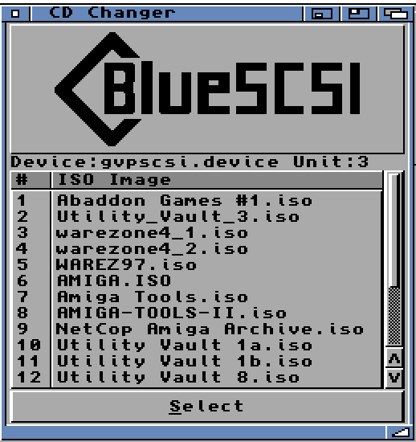
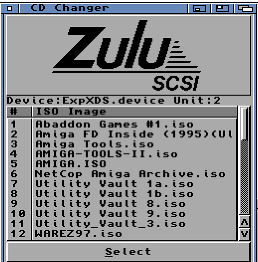
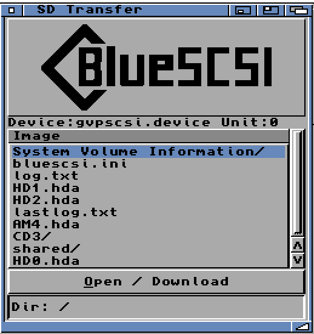

# SCSIToolbox-Amiga

Tools for the **Commodore Amiga** (AmigaOS 3.x, 68k) to manage a
[BlueSCSI V2](https://github.com/BlueSCSI/BlueSCSI-v2/) or
[ZuluSCSI](https://zuluscsi.com/) SCSI emulator via the Toolbox vendor command set.

> **This is a fork.** SCSIToolbox-Amiga is a fork of Paul Hill's
> [BlueSCSI-toolbox-Amiga](https://github.com/paulroberthill/BlueSCSI-toolbox-Amiga) (v1.3), extended with a mountable
> shared-folder filesystem handler. It remains licensed **GPL-3.0-or-later**, the same
> as upstream. See [Attribution & lineage](#attribution--lineage) and [License](#license).

Maintained by Laine Jones — <https://github.com/lainejones/>

You can select the device/unit from the icon's properties (Tool Types), or specify them
on the command line.

> **ZuluSCSI users:** enable the toolbox option. In `zuluscsi.ini` at the base of the SD
> card, under the `[SCSI]` section, set `EnableToolbox=1`.

---

## Tools

### CD Changer
Swap between CD ISO images on the SD card on the fly.

 

### SD Transfer
Transfer files from the SD card's shared folder to the Amiga.

### BlueSCSIToolbox (CLI)
Command-line access: `DIR`, `LISTCDS`, `SETCD N`, `RECEIVE=file` (download), and
`SEND=file` (upload). This fork **fixes the `SEND` upload path**, which never worked
upstream (wrong SCSI data direction and transfer length — see History).

### SHARED: filesystem handler — *new in this fork (in development)*
A read/write AmigaDOS handler that **mounts the emulator's shared folder as a volume**
(`SHARED:`), so native tools — `Copy`, `List`, Directory Opus, Workbench drag-and-drop —
can read from and write to it directly, instead of the one-file-at-a-time download.

Capabilities are bounded by the Toolbox firmware protocol: **list / read / create files**
are supported; **delete and rename are not** (the firmware exposes no such commands).
See the project `CLAUDE.md` for the protocol details and handler design.

---

## Attribution & lineage

**Direct upstream (this codebase):** the Amiga client tools were written by **Paul Hill**
and released as *BlueSCSI-toolbox-Amiga* under GPL-3.0-or-later. This fork preserves his
copyright and license; new and modified files carry change notices per GPLv3 §5.

**Device side (the emulator firmware these tools talk to):** the BlueSCSI/ZuluSCSI Toolbox
protocol comes from a chain of open-source projects —

- **SCSI2SD** — Michael McMaster — the foundational SCSI emulation firmware.
- **ZuluSCSI** — Rabbit Hole Computing — derived from SCSI2SD V6.
- **BlueSCSI v2** — Eric Helgeson — forked from ZuluSCSI (which carries SCSI2SD V6).

*(BlueSCSI **v1** descends separately from Akira Hattori's ArdSCSino-stm32.)*

The **BlueSCSI** and **ZuluSCSI** names and logos are trademarks of their respective
projects and are used here only to indicate compatibility. No endorsement is implied.

---

## License

GPL-3.0-or-later. See [LICENSE.txt](LICENSE.txt). Copyright © 2024 Paul Hill;
modifications © 2026 Laine Jones. The complete corresponding source is in this repository.

---

## History

**SCSIToolbox-Amiga (this fork) — Laine Jones**
* 1.4 — Fixed the CLI `SEND` (upload) path: corrected the SCSI data direction
  (`SCSIF_WRITE`, not `SCSIF_READ`) and per-command transfer lengths for
  `SEND_FILE_PREP`/`SEND_FILE_10`/`SEND_FILE_END`, which never worked upstream.
* 1.4 — Added reusable upload primitives (`Toolbox_Send_Prep`/`Block`/`End` +
  `Toolbox_Send_File`) to the shared SCSI layer (`scsi.c`) for the handler below.
* (in development) `SHARED:` read/write AmigaDOS filesystem handler — mount the shared
  folder as a native volume usable by `Copy`, `List`, Directory Opus, Workbench.
  *(Planned: multi-block `GET_FILE` reads when `CAP_LARGE_TRANSFERS` is present, added
  with the handler's read path where the larger buffer is warranted.)*

**BlueSCSI-toolbox-Amiga (upstream) — Paul Hill**
* 1.3 — GCC (amiga-gcc) build; numerous ReAction/ListBrowser and startup fixes.
* 1.2c (18.06.2024) — Removed some OS3.2 utility.library functions for older OS support
  (`Strncpy` => `strncpy`, `Strncat` => `strncat`).
* 1.2 (18.05.2024) — ZuluSCSI support, thanks to Stefan Reinauer (<https://zuluscsi.com/>).
* 1.1 (13.05.2024) — SCSI Command Descriptor length corrected to 10 bytes (per the Toolbox
  Developer Docs) — 6 bytes may have crashed the SCSI stack on non-BlueSCSI devices.

BlueSCSI is copyright Eric Helgeson. The BlueSCSI name and logo used with permission
(per the upstream project).
