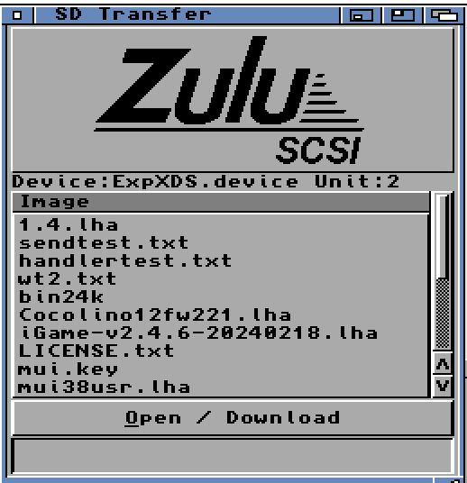

# SCSIToolbox-Amiga

Tools for the **Commodore Amiga** (AmigaOS 3.x, 68k) to manage a
[BlueSCSI V2](https://github.com/BlueSCSI/BlueSCSI-v2/) or
[ZuluSCSI](https://zuluscsi.com/) SCSI emulator via the Toolbox vendor command set —
including a mountable **`SHARED:` volume** and full **SD-card subfolder browsing**.

> **This is a fork.** SCSIToolbox-Amiga is a fork of Paul Hill's
> [BlueSCSI-toolbox-Amiga](https://github.com/paulroberthill/BlueSCSI-toolbox-Amiga) (v1.3),
> extended with a mountable shared-folder filesystem handler, a working `SEND` upload
> path, and working-directory (subfolder) support. It remains licensed
> **GPL-3.0-or-later**, the same as upstream.
> See [Attribution & lineage](#attribution--lineage) and [License](#license).

Maintained by Laine Jones — <https://github.com/lainejones/>

You can select the device/unit from each icon's properties (Tool Types), or specify
them on the command line (`DEVICE=scsi.device UNIT=n`).

> **ZuluSCSI users:** enable the toolbox option — in `zuluscsi.ini` under `[SCSI]`,
> set `EnableToolbox=1`.

---

## Tools

### SHARED: filesystem handler — *new in this fork*
A read/write AmigaDOS handler (`sharedfs`) that **mounts the emulator's shared folder
as a volume** (`SHARED:`), so native tools — `Copy`, `List`, Directory Opus, Workbench
drag-and-drop — read and write it directly, instead of one-file-at-a-time downloads.
With working-directory firmware (see below), **subfolders appear as real drawers** and
deep paths (`Copy SHARED:games/foo RAM:`) work, including AmigaDOS `/` parent syntax.

Install: `Copy sharedfs L:`, then `Mount SHARED: from SHARED.mountlist`
(see [src/SHARED.mountlist](src/SHARED.mountlist); set Device/Unit to your adapter —
a GVP variant ships as [src/SHARED-GVP.mountlist](src/SHARED-GVP.mountlist)). The
geometry keywords in the mountlist are dummies — Mount requires them, the handler
ignores them.

Bounded by the Toolbox firmware protocol: **list / read / create** are supported;
**delete, rename and makedir are not** (no such firmware commands — they fail
cleanly). Protection bits/comments/dates are accepted and discarded, so `Copy` works.

### SD Transfer
File browser for the SD card. Descend into folders and back up by **double-click**
(or the Open/Download button); browsing goes all the way up to the **SD card root**,
so the whole card is reachable, not just the shared folder. Downloads use an ASL
save requester with a progress gauge.

 

### CD Changer
Swap between CD ISO images on the SD card on the fly.

 

*(Screenshots captured on real hardware — Amiga 500 + GVP A530 + BlueSCSI, and
Amiga 1200 + DataFlyer SCSI+ + ZuluSCSI. The BlueSCSI/ZuluSCSI logo is picked
automatically from the detected device.)*

### BlueSCSIToolbox (CLI)
Command-line access:

```
BlueSCSIToolbox DEVICE=<driver> UNIT=<id> DIR | LISTCDS | SETCD n |
                RECEIVE=file | SEND=file | LISTDEVICES | INFO |
                SETDIR=/path | GETDIR | RESETDIR | SETDEBUG=0/1
```

`SETDIR` points all subsequent file/CD operations at an SD subfolder (it persists on
the device until power-off or `RESETDIR`) and combines with the other verbs:
`SETDIR=/shared/games DIR`. `INFO` reports the firmware's Toolbox API version and
capabilities. Note: reset with `RESETDIR` or `SETDIR=""` — a bare `SETDIR=` makes
ReadArgs consume the *next* argument as its value.

This fork also **fixes the `SEND` upload path**, which never worked upstream (wrong
SCSI data direction and transfer lengths — see History).

---

## Firmware requirements

- Base features (DIR/SEND/RECEIVE/CDs, flat `SHARED:`) work on any Toolbox-capable
  BlueSCSI/ZuluSCSI firmware.
- **Subfolder support** (SETDIR/GETDIR, SDTransfer navigation, `SHARED:` drawers)
  needs the working-directory Toolbox commands introduced in
  **BlueSCSI firmware v2026.04.27** (capability bit `0x04` in `INFO`). On older
  firmware — including ZuluSCSI firmware as of this writing, which has not adopted
  the extension — everything degrades gracefully to the previous flat behaviour.
- The working directory is **one global setting on the device**: don't run a
  navigating SDTransfer and a mounted `SHARED:` against the same unit simultaneously.

Tested on real hardware (2026-08): A500 + GVP A530 + BlueSCSI Pico W fw 2026.04.27
(full subfolder suite), and A1200 + DataFlyer SCSI+ + ZuluSCSI (flat behaviour and
capability gating).

## Building

Cross-compile with [amiga-gcc](https://github.com/bebbo/amiga-gcc) (bebbo, m68k):

```
cd src && make          # 68000 baseline; also: make 68020 / 68040 / 68060
```

**Do not run standalone `m68k-amigaos-strip` on the binaries** — it corrupts
AmigaOS hunk executables. The Makefile links with `-s`, which strips correctly.

---

## Attribution & lineage

**Direct upstream (this codebase):** the Amiga client tools were written by **Paul
Hill** and released as *BlueSCSI-toolbox-Amiga* under GPL-3.0-or-later. This fork
preserves his copyright and license; new and modified files carry change notices per
GPLv3 §5. See [ATTRIBUTION.md](ATTRIBUTION.md) for the full file-by-file provenance.

**Device side (the emulator firmware these tools talk to):** the BlueSCSI/ZuluSCSI
Toolbox protocol comes from a chain of open-source projects —

- **SCSI2SD** — Michael McMaster — the foundational SCSI emulation firmware.
- **ZuluSCSI** — Rabbit Hole Computing — derived from SCSI2SD V6.
- **BlueSCSI v2** — Eric Helgeson and contributors — forked from ZuluSCSI (which
  carries SCSI2SD V6). The working-directory Toolbox extension this fork's subfolder
  support builds on shipped in BlueSCSI firmware v2026.04.27.

*(BlueSCSI **v1** descends separately from Akira Hattori's ArdSCSino-stm32.)*

The Toolbox protocol is documented in the
[BlueSCSI Toolbox Developer Docs](https://bluescsi.com/docs/Toolbox-Developer-Docs).

The **BlueSCSI** and **ZuluSCSI** names and logos are trademarks of their respective
projects and are used here only to indicate compatibility. No endorsement is implied.

---

## License

GPL-3.0-or-later. See [LICENSE.txt](LICENSE.txt). Copyright © 2024 Paul Hill;
modifications © 2026 Laine Jones. The complete corresponding source is in this
repository.

---

## History

**SCSIToolbox-Amiga (this fork) — Laine Jones**
* CLI 1.6 / SDTransfer 1.5 — `RESETDIR/S`; SDTransfer browses above the start
  directory to the SD card root.
* SDTransfer 1.4 — double-click navigation (both directions).
* CLI 1.5 / SDTransfer 1.3 / sharedfs — **working-directory (subfolder) support**
  across all clients (BlueSCSI fw v2026.04.27 `SET/GET_WORKING_DIR`), capability-
  gated for older firmware. `SHARED:` becomes fully hierarchical: locks carry
  relative paths, every path component is validated against a real listing, reads
  navigate to the file's directory (GET_FILE indexes are per-directory).
* sharedfs — hardware-test fixes: OS 3.2 `Mount` needs (dummy) geometry keywords;
  `SET_PROTECT`/`SET_COMMENT`/`SET_DATE` are accepted as no-ops so `Copy` succeeds.
* 1.4 — Fixed the CLI `SEND` (upload) path: corrected the SCSI data direction
  (`SCSIF_WRITE`, not `SCSIF_READ`) and per-command transfer lengths for
  `SEND_FILE_PREP`/`SEND_FILE_10`/`SEND_FILE_END`, which never worked upstream.
  Added reusable upload primitives to the shared SCSI layer for the handler.
* 1.4 — `SHARED:` read/write AmigaDOS filesystem handler (browse, copy-from,
  copy-to, Workbench volume icon).

**BlueSCSI-toolbox-Amiga (upstream) — Paul Hill**
* 1.3 — GCC (amiga-gcc) build; numerous ReAction/ListBrowser and startup fixes.
* 1.2c (18.06.2024) — Removed some OS3.2 utility.library functions for older OS
  support (`Strncpy` => `strncpy`, `Strncat` => `strncat`).
* 1.2 (18.05.2024) — ZuluSCSI support, thanks to Stefan Reinauer (<https://zuluscsi.com/>).
* 1.1 (13.05.2024) — SCSI Command Descriptor length corrected to 10 bytes (per the
  Toolbox Developer Docs) — 6 bytes may have crashed the SCSI stack on non-BlueSCSI
  devices.

BlueSCSI is copyright Eric Helgeson. The BlueSCSI name and logo used with permission
(per the upstream project).
